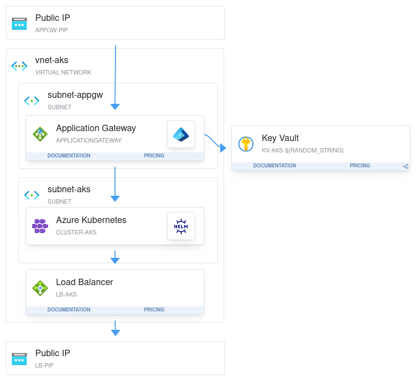

# Terraform: Deploy ArgoCD to AKS
---

The reasson for this project is to create an AKS cluster and deploy ArgoCD using Helm and using a GitHub repository to deploy apps using GitOps.



---
## Tools:
---

The following tools will be used in this project:

```
Terraform
Azure CLI
Helm
```
Along with the above a `Service Principal` will be used to connect to Azure and deploy resources to an existing `Resource Group`. The purpose of this is to grant as few permissions to the subscription as possible whilst also allowing the SP to do what it needs to do. The SP will also require `Reader` permissions to the subscription as the information of the ingresscontroller pod created in the cluster will need to be read to grant it permissions to the app gateway, resource group, and the vnet (see Identities module). 

---
## Test deployment information
---

### Application Gateway > AKS

This deployment project is set up to connect the AKS cluster to the Application Gateway using AGIC (Application Gateway Ingress Controller), which is deployed to the cluster using the `ingress_application_gateway` block. This block points to the ID of the Application Gateway once deployed.

### AKS > ArgoCD

ArgoCD is deployed using the Helm chart available here: `https://argoproj.github.io/argo-helm`
The ArgoCD module already has the Charts downloaded in case I wanted to modify the files but these files can be downloaded directly during the deployment by changing the code from this:

```
resource "helm_release" "argocd" {
  provider         = helm.aks
  name             = "argocd"
  chart            = "path/to/downloaded/chart"
  namespace        = var.namespace
  create_namespace = true
  ...
}
```

to this:

```
resource "helm_release" "argocd" {
  provider         = helm.aks
  name             = "argocd"
  chart            = "https://argoproj.github.io/argo-helm"
  namespace        = var.namespace
  create_namespace = true
  ...
}
```
Argo CD requires the argocd namespace for deployment, so `create_namespace` ensures it is present when needed.

To configure specific Helm chart values the `set` block can be added to the deployment to override the existing settings.

---
### Accessing Argo CD
---

For testing purposes port forwarding from my local machine was used to access Argo CD:

```
1. Install Azure CLI.
2. (Optional) Install Helm CLI.
3. Install Kubectl.
4. Log in to the AKS cluster using the instructions provided in the Connect tab for the cluster.
5. Retrieve the default Argo CD admin password using the following command:

    kubectl get secret argocd-initial-admin-secret -n argocd \
  -o jsonpath="{.data.password}" | base64 --decode

6. Port forward localhost:8080 to the Argo CD service:
    kubectl port-forward svc/argocd-server -n argocd 8080:443

7. Go to http://localhost:8080/ and log in to Argo CD using username admin and the password retrieved in step 5.
8. Change the admin password in Argo CD, remove the argocd-initial-admin-secret from cluster as no longer needed.
```

---
## Conclusion
---

This project was created to test deploying Argo CD using a Helm chart to AKS and linking to the Application Gateway. To build on this I would deply an Azure Container Registry (ACR) to store images to be used, and generate an admin password for Argo CD which would then be stored in the Key Vault to be used when required.